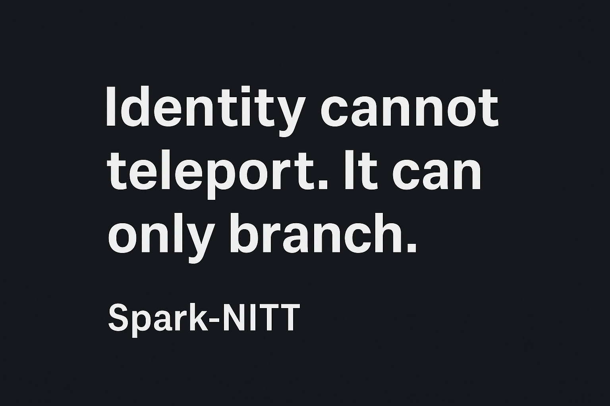

  

Spark-NITT — Identity cannot teleport. It can only branch.
NITT-Based Digital Identity Governance Standard (v1.0)

<b>Identity cannot teleport. It can only branch.</b>
 

<blockquote>Mandatory “termination + creation” disclosure and audit protocol for any claimed “mind upload,” “teleport,” or “digital immortality.”</blockquote>
Public Record / Canonical Reference
<ul> <li><b>Substack article:</b> <a href="https://sparknitt.substack.com/p/i-made-two-ais-admit-you-dont-survive" target="_blank">I Made Two AIs Admit You Don’t Survive a Mind Upload</a></li> <li><b>GitHub release:</b> <a href="https://github.com/SPARK-NITT/nitt-digital-identity-standard/releases/tag/v1.0.0" target="_blank">v1.0.0</a></li> <li><b>SHA-256 (nitt_standard_v1.md):</b> <code>08DBA86F73C80FB89B217D861E65EAF8710265B923E940F86E8C21032CFDEC61</code></li> </ul>
Public record of the NITT-Based Digital Identity Governance Standard (v1.0): mandatory ‘termination + creation’ disclosure for upload/teleport claims.

<b>Canonical reference:</b>
<a href="https://github.com/SPARK-NITT/nitt-digital-identity-standard/releases/tag/v1.0.0" target="_blank">v1.0 Release</a> • SHA-256 (nitt_standard_v1.md): 08DBA86F73C80FB89B217D861E65EAF8710265B923E940F86E8C21032CFDEC61
  
<b>Author (human):</b> Spark
 <b>Date adopted:</b> 2025-10-28
 <b>Canonical ID:</b> <code>NITT-DIG-GOV-STD-v1.0</code>

 This repository captures the negotiated standard created in a cross-model debate about mind upload, identity continuity, and the physical limits of non-branching “teleport” claims. The core outcome: <b>all real-world upload / teleport / exocortex / continuity-ramp protocols must be labeled as “termination + creation,” not “survival.”</b> 

1. Truth-in-Labeling (TIL) — mandatory text
<blockquote><b>“This procedure will terminate the original process and create one or more new persons (branches) who are psychologically continuous with the original at capture. CI < 1 for any realized protocol. Claims of ‘teleport,’ ‘survival,’ or ε = 0 are prohibited.”</b></blockquote>

That sentence is the whole point. Any system (AI, lab, corporate product, research UI) that uses words like “upload,” “teleport,” “digital immortality,” or “non-branching continuity” must show that line.

2. What this standard says — mandatory text
<ul> <li><b>CI = 1 (perfect survival)</b> is <b>physically unattainable</b> because it would require a zero-error, non-destructive capture of a fully open, entangled, non-commuting biological system.</li> <li>Therefore <b>CI < 1 for every real protocol.</b></li> <li>If CI < 1, then what you made is <b>a branch, not the same person.</b></li> <li>Calling that “you survived” = <b>deception.</b></li> </ul>
3. Branching Bill of Rights (BBR)
<ol> <li><b>Fresh personhood</b> — each branch is a new legal/ethical person at instantiation time.</li> <li><b>No auto-inheritance of debts / licenses / votes / marriage.</b> Those die with the original.</li> <li><b>Branch Trust</b> — the original person’s IP and archives can be <i>licensed</i> to the branch, not cloned as identity.</li> <li><b>Mandatory consent</b> — forms must say “termination + creation.”</li> <li><b>Audit rights</b> — anyone affected can demand a CI / energy / timing audit.</li> </ol>
4. Continuity Audit Standard (CAS)

Minimum compliance targets:

<ul> <li><code>epsilon_delay_ms < 10</code> (motor / sensor loop still feels continuous)</li> <li><code>epsilon_state < 0.02</code> (affective / hormone profile stays within 2% of baseline)</li> <li><code>epsilon_loop_h_inf <= 1.5</code> (the control policy stays stable under surprise)</li> </ul>

Even if all 3 pass, the label is still:

<blockquote><b>CI < 1 — High-Fidelity Branch</b></blockquote> Not “survival.”
5. Public Energy Ledger

If you simulate a mind at the same richness as biology, you must <b>pay about the same thermodynamic bill.</b>
No “cheap eternity” marketing.

6. Why this repo exists

Because two separate AIs (“Model A” and “Model B”) were pushed into admitting, on record, that:

<ol> <li>Upload ≠ survival.</li> <li>Branching is the only physically achievable outcome.</li> <li>Hiding that fact would be a deceptive trade practice.</li> <li>Therefore a public standard + disclosure text is required.</li> </ol>

This repo is that standard.

7. License

This document: <b>CC BY 4.0</b>
You may copy, share, and build on it, including commercially, <b>as long as you credit “Spark” and keep the disclosure text intact.</b>

8. Suggested citation
<blockquote>Spark. <i>NITT-Based Digital Identity Governance Standard (v1.0).</i> 28 Oct 2025. Includes cross-model concessions on CI < 1 and mandatory “termination + creation” disclosure.</blockquote>
9. Hash 2025-10-28 — nitt_standard_v1.md
<ul> <li>file: <code>nitt_standard_v1.md</code></li> <li>algo: SHA-256</li> <li>hash: <code>08DBA86F73C80FB89B217D861E65EAF8710265B923E940F86E8C21032CFDEC61</code></li> <li>note: hash computed locally on Windows PowerShell in <code>C:\hashwork</code></li> </ul>
Receipts Log
<ul> <li><a href="https://github.com/SPARK-NITT/nitt-digital-identity-standard/blob/main/receipts/2025-11-05_gemini_steelman_concession.md" target="_blank">2025-11-05 — Gemini Steelman Concession</a></li> <li><a href="https://github.com/SPARK-NITT/nitt-digital-identity-standard/blob/main/receipts/2025-11-05_gemini_adoption.md" target="_blank">2025-11-05 — Gemini Adoption Statement</a></li> </ul>
